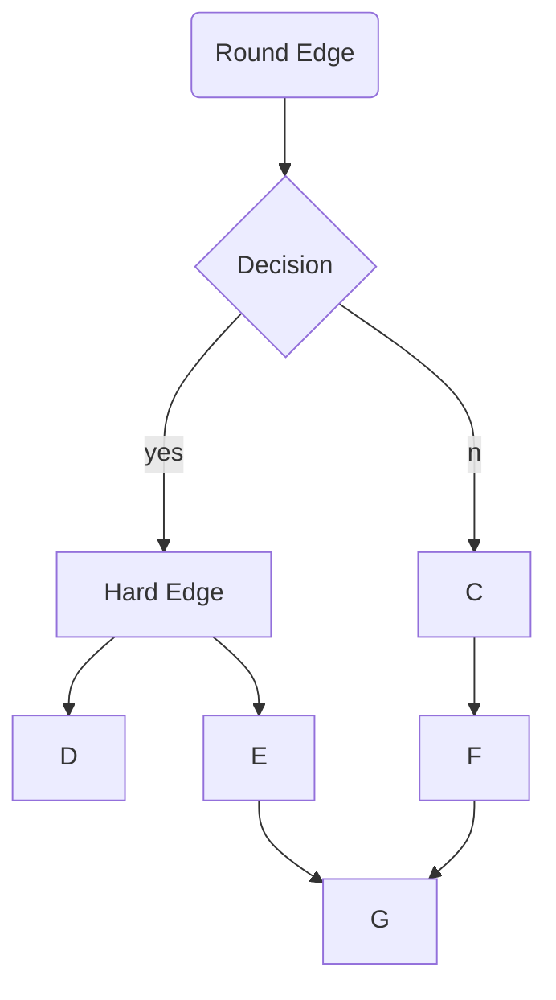

<!-- Markdown has 6 headings h1 to h6.
Number of prefixed hashtags(#) indicates the order of heading 
Add a space after the hashtags, or else github might not interpret it correctly -->
# h1
## h2
### h3
#### h4
##### h5
###### h6

<!-- A single asterisk or underscore around a string turns it to italic  -->
*asterisk*
_underscore_
<!-- A double asterisk or underscore around a string turns it to bold  -->
**asterisk**
__underscore__
<!-- Combining italics and bold -->
***bold italic***
**bold and *italic***
<!-- Double tildes around a string strikes through it  -->
~~strike-through~~
<!-- Three hyphens create a horizontal ruler -->
---
<!-- Two hashtags create a vertical tab -->
##

<!-- This is a flowchart made using mermaid library of javascript -->

---

<!-- For ordered list, "mandatory single dot and single space"
For unordered list, "mandatory single plus, minus or asterisk" -->
<!-- For a sub list,three spaces before declaration of type of list is mandatory. -->
<!-- For ordered list, the number doesn't matter; it just has to be a number. Markdown can order it accordingly -->
<!-- Adding comments between list can break it. -->
1. Ordered Main List Item 1
   + Unordered sub-List 1, Item 1
   + Unordered sub-List 1, Item 2
7. Ordered Main List Item 2 
0. Ordered Main List Item 3
   + Unordered sub-List 2, Item 1
   + Unordered sub-List 2, Item 2

<!-- To add an anchor, use [anchor text](url) -->
To go to Google click [here..](https://www.google.com)

---

<!-- To add an image, use  -->
<!-- You cannot edit height and width using markdown, so use inline HTML instead. -->
<!--  -->


---

<!-- To add an image as anchor, use [](url) -->
Click this image to go to Unsplash :


<!-- [](https://unsplash.com/) -->
<a href="https://unsplash.com/" target="blank"></a>

---

- Inline-HTML
<!-- You can directly write HTML in Markdown, but its not preffered. -->
<table align="center">
<tr>
<th>Heading 1</th>
<th>Heading 2</th>
<th>Heading 3</th>
</tr>
<tr>
<td>Row 1, Item 1</td>
<td colspan=2>Row 1, Item 2</td>
</tr>
<tr>
<td colspan=2>Row 2, Item 1</td>
<td>Row 2, Item 2</td>
</tr>
</table>

---

Inline `code` has `back-ticks around` it.

<!-- Blocks of code are fenced by lines with three back-ticks ``` . After the black-ticks; programming language.
If no language is specified, it works as pre tag of HTML. -->

```c
#include <stdio.h>

void main(){
    int a=7;
    int b=9;
    sum(a,b);
}

void sum(int a, int b){
    printf("Sum of %d and %d is %d.",a,b,(a+b));
}
```

```python
for i in range(7):
    print(i)
```

```
    Hello
        Hello
            Hello
```
---

Footnotes:
<!-- Use [^footnoteName] to create a footnote.
Use [^footnoteName]: "Footnote text" to add the description of footnote. -->

Here is a simple footnote[^1].
[^1]: My reference.

A footnote can also have multiple lines[^name].
[^name]: Every new line should be prefixed with 2 spaces.  
  This allows you to have a footnote with multiple lines.

---

<!-- Two lines after a paragraph create a new paragraph. -->

<!-- There must be at least 3 dashes separating each header cell.
There must be one pipe(|) between each inner cell. -->
Head1 | Head2 | Head3
---|---|---
row1 col1| row1 col2 | **row1 col3**
row2 col1| *row2 col2* | row2 col3

---

<!-- Greater than sign is used to create a block quote -->
>This is a blockquote

Quote break:
>This is a very long line that will still be quoted properly when it wraps. Let's keep writing to make sure this is long enough to actually wrap.

---

You cannot embed YouTube videos in markdown using iframe:


You can use it by adding thumbnail of video as a link to the video:


<a href="https://www.youtube.com/watch?v=Sy-VjLr14pI&ab_channel=DJSANTARIKSH" target="blank"></a>

<style>
    .image{
        border-radius: 15px;
        border: 3px solid gray
    }
</style>    