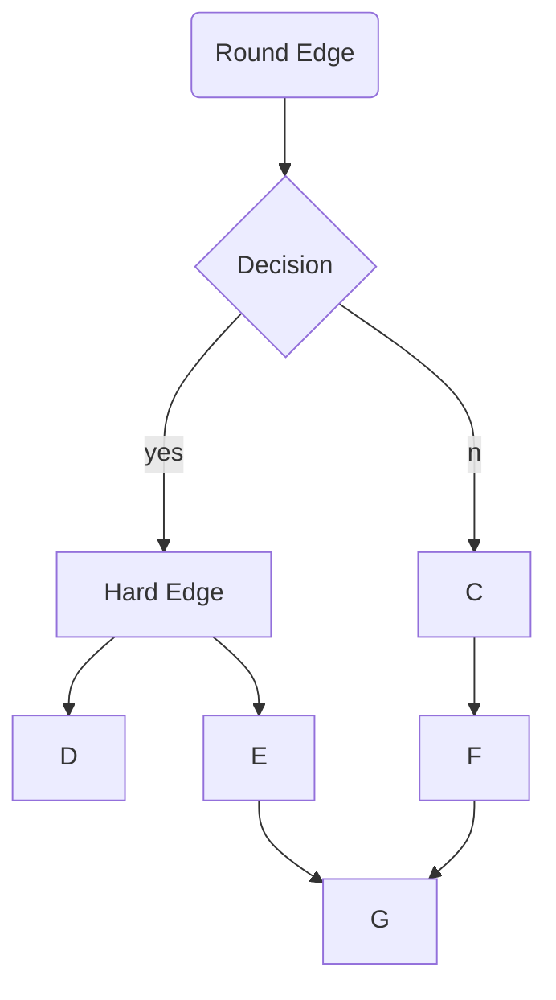

<!-- Markdown has 6 headings h1 to h6.
Number of prefixed hashtags(#) indicates the order of heading 
Add a space after the hashtags, or else github might not interpret it correctly -->
# h1
## h2
### h3
#### h4
##### h5
###### h6

<!-- A single asterisk or underscore around a string turns it to italic  -->
*asterisk*
_underscore_
<!-- A double asterisk or underscore around a string turns it to bold  -->
**asterisk**
__underscore__
<!-- Combining italics and bold -->
***bold italic***
**bold and *italic***
<!-- Double tildes around a string strikes through it  -->
~~strike-through~~
<!-- Three hyphens create a horizontal ruler -->
---
<!-- Two hashtags create a vertical tab -->
##

<!-- This is a flowchart made using mermaid library of javascript -->

---

<!-- For ordered list, "mandatory single dot and single space"
For unordered list, "mandatory single plus, minus or asterisk" -->
<!-- For a sub list,three spaces before declaration of type of list is mandatory. -->
<!-- For ordered list, the number doesn't matter; it just has to be a number. Markdown can order it accordingly -->
<!-- Adding comments between list can break it. -->
1. Ordered Main List Item 1
   + Unordered sub-List 1, Item 1
   + Unordered sub-List 1, Item 2
7. Ordered Main List Item 2 
0. Ordered Main List Item 3
   + Unordered sub-List 2, Item 1
   + Unordered sub-List 2, Item 2

<!-- To add an anchor, use [anchor text](url) -->
To go to Google click [here..](https://www.google.com)

<!-- To add an image, use  -->

<!-- To add an image as anchor, use  -->
Click this image to go to Unsplash :

