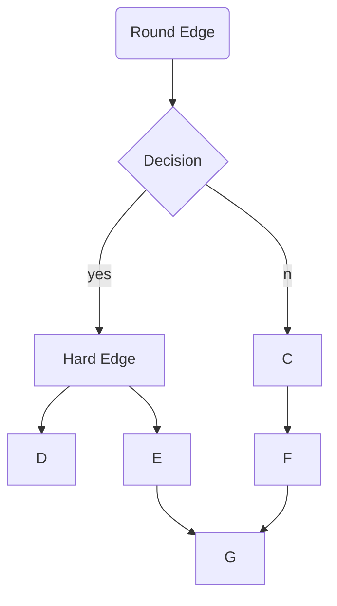

<!-- Markdown has 6 headings h1 to h6.
Number of prefixed hashtags(#) indicates the order of heading -->
#h1
##h2
###h3
####h4
#####h5
######h6

<!-- A single asterisk or underscore around a string turns it to italic  -->
*asterisk*
_underscore_
<!-- A double asterisk or underscore around a string turns it to bold  -->
**asterisk**
__underscore__
<!-- Combining italics and bold -->
***bold italic***
**bold and *italic***
<!-- Double tildes around a string strikes through it  -->
~~strike-through~~
<!-- Three hyphens create a horizontal ruler -->
---
<!-- Two hashtags create a vertical tab -->
##

<!-- This is a flowchart made using mermaid library of javascript -->

